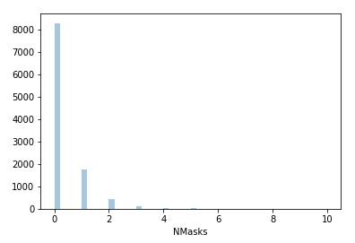
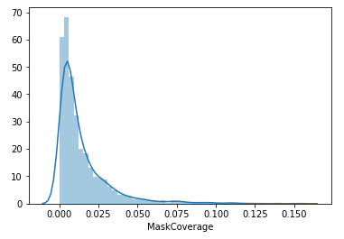

# Kaggle-SIIM

## Discussion
* [Dmytro Panchenko:How is metric calculated?](https://www.kaggle.com/c/siim-acr-pneumothorax-segmentation/discussion/97225#latest-563443):讲解指标的计算方式
* [Heng CherKeng: starter kit](https://www.kaggle.com/c/siim-acr-pneumothorax-segmentation/discussion/97456#latest-563494): 收集各种分割的trcik并进行复现
* [Previous segmentation challenges](https://www.kaggle.com/c/siim-acr-pneumothorax-segmentation/discussion/96992#latest-563339):以前的分割竞赛 [Resources | Papers With (really good) Code](https://www.kaggle.com/c/siim-acr-pneumothorax-segmentation/discussion/97198#latest-561177)
* [Optimizing Dice is Harder than IoU](https://www.kaggle.com/c/siim-acr-pneumothorax-segmentation/discussion/97474#latest-563400): 讨论IoU是不是子模函数 [Yes, IoU loss is submodular – as a function of the mispredictions](https://arxiv.org/pdf/1809.01845.pdf) [INTERSECTION OVER UNION IS NOT A SUBMODULAR FUNCTION](https://arxiv.org/pdf/1809.00593.pdf)
* [Heng CherKeng: baseline methods](https://www.kaggle.com/c/siim-acr-pneumothorax-segmentation/discussion/97518#latest-562789):包含肺部检测的论文和代码
* [Timestamp in file names ?](https://www.kaggle.com/c/siim-acr-pneumothorax-segmentation/discussion/97119#latest-562337):发现文件名是时间戳
  ```python
  from datetime import datetime
  ts = 1517875163.537053
  print(datetime.utcfromtimestamp(ts).strftime('%Y-%m-%d %H:%M:%S'))

  2018-02-05 23:59:23
  ```
 
## Kernel
* [EDA](https://www.kaggle.com/unvirtual/eda-of-training-test-data/notebook):
* [Image+Mask Augmentations--pytorch](https://www.kaggle.com/abhishek/image-mask-augmentations):图像分割的数据扩充方法
* [dataset:DICOM + MASK+ PNG + FHIR](https://www.kaggle.com/anisayari/siimacrpneumothoraxsegmentationzip-dataset)：处理好的数据集，包含mask，png等
* [First steps with SIIM-ACR Pneumothorax Data](https://www.kaggle.com/steubk/first-steps-with-siim-acr-pneumothorax-data/comments?scriptVersionId=16473604#The-bimodal-mean_pixel_value-distribution):数据分布的探索
* [mask-rcnn with augmentation and multiple masks](https://www.kaggle.com/abhishek/mask-rcnn-with-augmentation-and-multiple-masks/notebook): pytorch mask-rcnn的训练， LB=0.8042
* [Visualizing Submission File](https://www.kaggle.com/abhishek/visualizing-submission-file): 可视化mask
* [Postprocessing for Hypercolumns kernel](https://www.kaggle.com/iafoss/postprocessing-for-hypercolumns-kernel-0-8286-lb): 模型训练完成后的后处理，包括置信度阈值的选择，mask大小阈值的选择，submission.csv中泄漏的信息的利用等https://www.kaggle.com/giuliasavorgnan/pneumothorax-models-ensemble-average/data
* [Pneumothorax Models Ensemble (average)](https://www.kaggle.com/giuliasavorgnan/pneumothorax-models-ensemble-average/data): 将不同方法的模型在结果层次集成的方法，但是目前还没有提升
* [rather-silly-1am-ensemble](https://www.kaggle.com/konradb/rather-silly-1am-ensemble/notebook): 最简单的直接将csv文件融合的方法，将相同图片中有病灶的mask复制给无病灶的图片，将两个模型的预测结果融合，增加了mask的数量，可以提升一定的分数
* [simple-data-augmentation-fastai](https://www.kaggle.com/anisayari/simple-data-augmentation-fastai): 使用fast.ai进行数据扩充
* [align-lung-images-using-pre-trained-model](https://www.kaggle.com/bguberfain/align-lung-images-using-pre-trained-model): 使用其他比赛的预训练模型进行肺部检测，但是效果看起来不是很好

## Discover
* 肺部吸入与呼出空气使图像灰度直方图有两个峰值

  
  
* 数据集有10712张图像，但是只有10675张图像有标注，有mask的图像有2379张，大部分只有1个mask

  
  
* mask占比

  
  
## Experiment
* Mask-RCNN

| 方法 | 结果 | 备注 |
| :------| ------: | :------: |
| baseline | 0.8042 | epoch = 5 |
| RandomColor | 0.7888 | down | 
| epoch: 5->20 | 0.8054 |  |
| epoch:20, vertical_flip | 0.8043 | down |
| epoch:20, rotation | 0.7988 | down |
| epoch:20, clahe | 0.8043 | down |


| 方法 | epoch | 结果 |
| :------| ------: | :------: |
| Mask-RCNN+HFlip | 5 | 0.8025 |
| CLAHE | 5 | 0.8037 | 
| VFlip | 5 | 0.8031 |
| Freeze layer1 | 5 | 0.8037 |
| Gradual Warmup LR | 10 | 0.8033 |
| CLAHE+VFlip+Freeze Layer1+GWarmup LR+im_normalization | 20 | 0.8039 |
| Random Crop | 5 | down |
