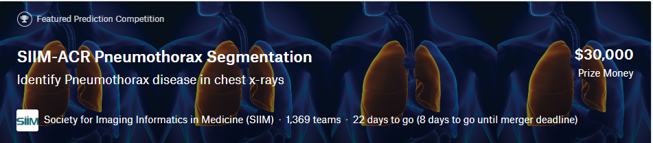
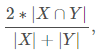
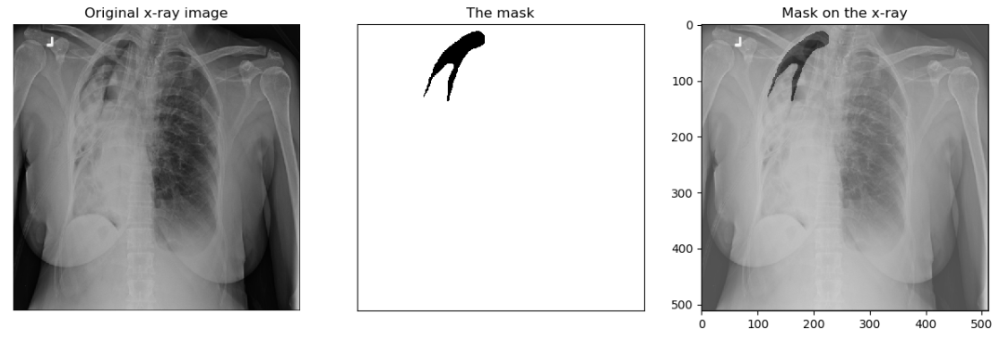
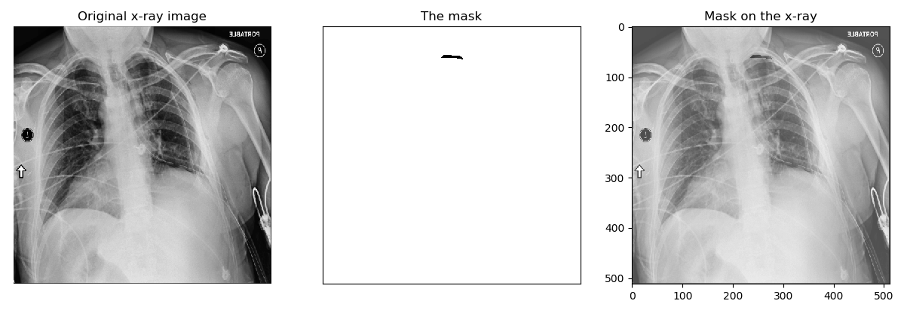
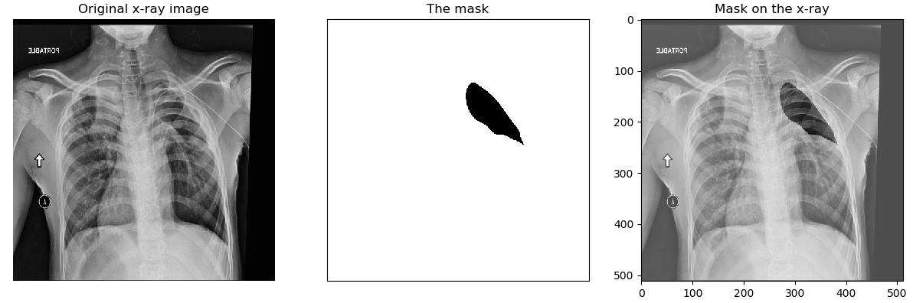

# [Kaggle-SIIM-ACR Pneumothorax Segmentation](https://www.kaggle.com/c/siim-acr-pneumothorax-segmentation)


## Metric
Dice coefficient



当预测值X与 Ground Truth Y 均为空时，dice=1

## EDA
* 样例图像

   
   
   
   
   
   
   mask 有较大的，也有较小的，也有分散的多个mask的，也有大量没有mask的
   
* 肺部吸入与呼出空气使图像灰度直方图有两个峰值

  
  
  mean=0.49, std=0.249
  
* 数据集有10712张图像，但是只有10675张图像有标注，有mask的图像有2379张，大部分只有1个mask

  
  
* mask占比

  
  
  预测时过滤掉面积小于 75.0*(1024/128.0)\*\*2 的区域
  
## Data Augmentation
* HorizontalFlip
* CLAHE
* CenterCrop (light) 
* RandomContrast RandomGamma RandomBrightness
* ElasticTransform GridDistortion OpticalDistortion

## Model
* UNet-ResNet34
* DeepLabV3-ResNet50
* upsample: [CARAFE]()

  `CARAFE`: 一个轻量级通用上采样算子，增加少许计算量，使上采样变为可训练的模式，替换了`UNet`中的`bilinear`
  
  [知乎：CARAFE: 轻量级通用上采样算子](https://zhuanlan.zhihu.com/p/76063768)
  
## Optimizer
* [RAdam](https://arxiv.org/abs/1908.03265)
* SGD + Gradual_Warmup_LR_Scheduler

## Loss
* DiceLoss
* Weight_Soft_Dice_Loss
* BCELoss
* MixedLoss (Focal Loss + Dice Loss)
* Weight_BCELoss
* Lovasz_Loss (for fine tuning)

## Others
* Gradient Accumulation
* TTA
* Ensemble

## RUN
### ENVS
* python = 3.5+
* pytorch = 1.0+
* torchvision = 0.3.0
* albumentations = 0.3.0
* visdom = 0.1.8.8

### RUN
* 下载项目

  ```git
  git clone https://github.com/xungeer29/Kaggle-SIIM
  ```
  
* 切换路径

  ```Linux
  cd Kaggle-SIIM
  ```
  
* 更改`config.py`中的数据路径
* 启动`visdom`

  ```linux
  python -m visdom.server
  ```
  
* train

  ```linux
  python main.py
  ```

* ensemble

  ```linux
  python ensemble.py
  ```
